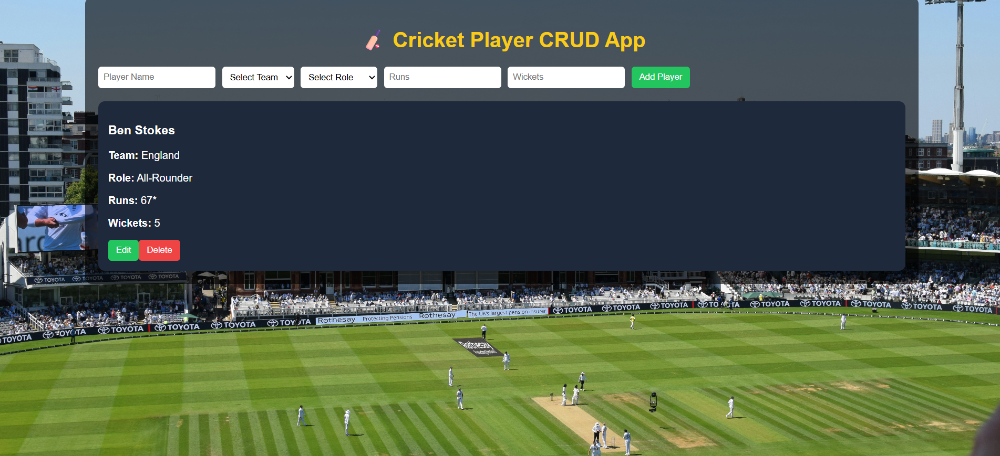

# Cricket CRUD App 🏏

 <!-- Replace with actual screenshot -->

This is a **React-based Cricket Player Management System** built using **Vite**.  
It allows you to **Add, View, Edit, and Delete cricket players**.  
The app features a **Lords Cricket Ground background** for better visualization.

## Features

- Add new cricket players with:
  - Name
  - Team
  - Role (Batsman, Bowler, All-Rounder, Wicketkeeper)
  - Runs
  - Wickets
- Edit and delete existing players
- Responsive design
- Background image of **Lords Cricket Ground**
- Built using **React**, **Vite**, and **CSS**

## How to Run Locally

1. Clone the repository:

```bash
git clone https://github.com/Prabil155/cricket-crud.git

